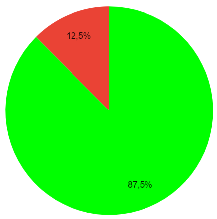

## Histórico de Versões

**Data** | **Versão** | **Descrição** | **Autor(es/as)** | **Revisor** |
:---: | :---: | :---: | :---: | :---: |
08/01/2023 | 0.1 | Inspeção do Questionário | Guilherme Barbosa | Letícia |

## 1. Introdução

&emsp;&emsp;Para verificar o Artefato Questionário do [Grupo 05 - Google Maps](https://requisitos-de-software.github.io/2022.2-GoogleMaps/elicitacao/5.questionario/), utilizaremos a estratégia de inspeções mencionada no [Planejamento](../planejamento.md).

## 2. Preparação

&emsp;&emsp;Para fazer a inspeção vamos utilizar um "checklist" com algumas perguntas com base nas referências utilizadas para a elaboração do artefato e os critérios de avaliação do artefato adotados na disciplina, dessa forma, poderemos analisar se este está correto com base nessas perguntas. Quando o critério for atentido, terá um "check" confirmando e quando não estiver , terá um "X" dizendo que não está correto. Conforme a legenda abaixo:

- ✅ : Atendido
- ❌ : Não Atendido

## 3. Inspeção do Questionário

|ID|Questão| Inspeção |
|-----------|-------------|:-------------:|
| 1 | O documento possui versionamento com versão, data, autor e revisor?| ✅ |
| 2 | O Artefato contem o objetivo do uso da técnica? | ✅ |
| 3 | O Artefato apresenta a metodologia? | ❌ |
| 4 | O Artefato está bem estruturado? | ✅ |
| 5 | Apresenta os resultados do questionário? | ✅ |
| 6 | As tabelas e figuras possuem autores e descrição? | ✅ |
| 7 | Conseguiu elicitar algum requisito com a técnica? | ✅ |
| 8 | Os requisitos tem ID, Tipo e Descrição? | ✅ |

## 3.1 Resultados da Inspeção
&emsp;&emsp;A partir da inspeção do artefato verificamos que o documento atende com 7 dos 8 critérios de avaliação definidos, dessa forma apresentando uma taxa e acertos de 87.5% como podemos ver a partir do gráfico abaixo:

<figure markdown>

<figcaption>
    <b>Figura 1: Gráfico da inspeção do Questionário</b>
     <small> Fonte: Elaboração Própria </small>
</figcaption>
</figure>

&emsp;&emsp; A partir da inspeção do artefato verificamos que o documento não atende todos os critérios, necessitando de pequenas alterações, adaptando o contéudo escrito a um tópico específico de metodologia.

## Referências

> SERRANO, Maurício; SERRANO, Milene. Requisitos - Aula 23. 1º/2022. Material apresentado para a disciplina de IHC no curso de Engenharia de Software da UnB, FGA.