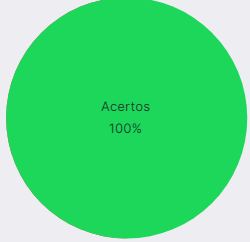

# Verificação do Storytelling

## Histórico de versões
| Data       | Versão | Descrição            | Autor                                         | Revisor                                      |
| ---------- | ------ | -------------------- | --------------------------------------------- | -------------------------------------------- |
| 07/01/2022 | 1.0    | Criação do documento | Samuel | Mateus |
## 1. Introdução

&emsp;&emsp;Para verificar o [Storytelling](../../elicitacao/storytelling.md) do nosso projeto, usaremos a estratégia de "inspeções", seguindo o planejamento detalhado na página de [Planejamento da verificação](../planejamento.md)

## 2. Preparação

&emsp;&emsp;Para fazer a inspeção vamos utilizar um "checklist" com algumas perguntas com base nas referências utilizadas para a elaboração do artefato e os critérios de avaliação do artefato adotados na disciplina, dessa forma, poderemos analisar se este está correto com base nessas perguntas. Quando o critério for atentido, terá um "check" confirmando e quando não estiver , terá um "X" dizendo que não está correto. Conforme a legenda abaixo:

- ✅ : Atendido
- ❌ : Não Atendido

&emsp;&emsp;Além disso, após identificarmos os erros presentes no artefato, iremos consertá-los, assim produzindo uma segunda versão do artefato e da checklist.

&emsp;&emsp;A checklist definida pode ser encontrada abaixo:

|ID|Questão| Inspeção |
|-----------|-------------|-------------|
| 1 | O Artefato contem o objetivo do uso da técnica? |  |
| 2 | O Artefato apresenta a metodologia? |  |
| 3 | O storytelling utiliza as personas ou clientes?|  |
| 4 | Apresenta as histórias contadas? | |
| 4 | Apresenta as histórias com fácil compreensão? | |
| 5 | Conseguiu extrair Requisitos da técnica? | |
| 6 | Apresenta uma tabela com os requisitos extraídos? | |

<figcaption align='center'>
    <b>Tabela 1: Preparação checklist Avaliação Protótipo de Papel </b>
     <small> Fonte: Tabela de considerações da apresentação da etapa 4 da disciplina de IHC(Adaptado)</small>
</figcaption>

## 3. Inspeção Storytelling

&emsp;&emsp;A checklist após inspeção do [Storytelling](../../elicitacao/storytelling.md) pode ser encontrada abaixo:

|ID|Questão| Inspeção |
|-----------|-------------|-------------|
| 1 | O Artefato contem o objetivo do uso da técnica? | ✅ |
| 2 | O Artefato apresenta a metodologia? | ✅ |
| 3 | O storytelling utiliza as personas ou clientes?| ✅ |
| 4 | Apresenta as histórias contadas? |✅ |
| 4 | Apresenta as histórias com fácil compreensão? |✅ |
| 5 | Conseguiu extrair Requisitos da técnica? |✅ |
| 6 | Apresenta uma tabela com os requisitos extraídos? |✅ |

<figcaption align='center'>
    <b>Tabela 2: Checklist da inspeção do Perfil de usuário </b>
</figcaption>

### 3.1 Resultados da inspeção
&emsp;&emsp; A partir da inspeção do artefato verificamos que o documento atende com 10 dos critérios de avaliação definidos, dessa forma apresentando uma taxa e acertos de 100% como podemos ver a partir do gráfico abaixo:

<figcaption align='center'>
    <b>Figura 1: Gráfico Storytelling  </b>
     <small> Fonte: Elaboração Própria </small>
</figcaption>

&emsp;&emsp; A partir da inspeção do artefato verificamos que o documento atendia com todos os critérios de avaliação definidos na checklist, não precisando ser modificado ou alterado.

## Referências

> SERRANO, Maurício; SERRANO, Milene. Requisitos - Aula 23. 1º/2022. Material apresentado para a disciplina de IHC no curso de Engenharia de Software da UnB, FGA.
