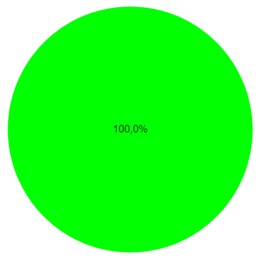

# Verificação do Rich Picture

## Histórico de versões
| Data | Versão | Descrição | Autor | Revisor |
| :---: | :---: | :---: | :---: | :---: |
| 09/01/2022 | 0.1 | Criação do documento | Breno | Guilherme |

## 1. Introdução

&emsp;&emsp;Para verificar o artefato **RichPicture** do projeto do Grupo 5 - [Google Maps](https://requisitos-de-software.github.io/2022.2-GoogleMaps/), usaremos a estratégia de "inspeções", seguindo o planejamento detalhado na página de [Planejamento da verificação](../planejamento.md)

## 2. Preparação

&emsp;&emsp;Para fazer a inspeção vamos utilizar um "checklist" com algumas perguntas com base nas referências utilizadas para a elaboração do artefato e os critérios de avaliação do artefato adotados na disciplina, dessa forma, poderemos analisar se este está correto com base nessas perguntas. Quando o critério for atendido, terá um "check" confirmando e quando não estiver , terá um "X" dizendo que não está correto. Conforme a legenda abaixo:

- ✅ : Atendido
- ❌ : Não Atendido

&emsp;&emsp;A checklist definida pode ser encontrada abaixo:

| ID |Questão| Inspeção |
| :---: | --- | :---: |
| 1 | Possui versionamento? |  |
| 2 | O artefato possui introdução? |  |
| 3 | O artefato possui uma explicação da metodologia utilizada? |  |
| 4 | Apresenta os atores/stakeholders? | |
| 5 | A simbologia foi utilizada da maneira correta? | |
| 6 | Está organizado de uma forma que facilite o entendimento? | |
| 7 | As setas estão representando o fluxo corretamente? | |
| 8 | A fronteira foi definida? | |
| 9 | Os atores/stakeholders estão fora da fronteira? | |
| 10 | Possui um foco principal bem definido? | |
| 11 | Possui as referências utilizadas? | |

<figcaption align='center'>
    <b>Tabela 1: Preparação checklist do RichPicture </b>
     <small> Fonte: Tabela de considerações da apresentação da etapa 4 da disciplina de IHC(Adaptado)</small>
</figcaption>

## 3. Inspeção RichPicture

&emsp;&emsp;A checklist após inspeção do **RichPicture** pode ser encontrada abaixo:

| ID | Questão | Inspeção |
| :---: | --- | :---: |
| 1 | Possui versionamento? | ✅ |
| 2 | O artefato possui introdução? | ✅ |
| 3 | O artefato apresenta o aplicativo? | ✅ |
| 4 | Apresenta os atores/stakeholders? | ✅ |
| 5 | A simbologia foi utilizada da maneira correta? | ✅ |
| 6 | Está organizado de uma forma que facilite o entendimento? | ✅ |
| 7 | As setas estão representando o fluxo corretamente? | ✅ |
| 8 | A fronteira foi definida? | ✅ |
| 9 | Os atores/stakeholders estão fora da fronteira? | ✅ |
| 10 | Possui um foco principal bem definido? | ✅ |
| 11 | Possui legenda? | ✅ |
| 12 | Possui as referências utilizadas? | ✅ |

<figcaption align='center'>
    <b>Tabela 2: Checklist da inspeção do RichPicture </b>
</figcaption>

### 3.1 Resultados da inspeção
&emsp;&emsp; A partir da inspeção do artefato verificamos que o documento atende com 12 dos critérios de avaliação definidos, dessa forma apresentando uma taxa e acertos de 100% como podemos ver a partir do gráfico abaixo:

<figcaption align='center'>
    <b>Figura 1: Gráfico RichPicture  </b>
     <small> Fonte: Elaboração Própria </small>
</figcaption>

&emsp;&emsp; A partir da inspeção do artefato verificamos que o documento atende com **100%** dos critérios de avaliação definidos na checklist, não necessitando de melhorias.

## Referências

> * SERRANO, Maurício; SERRANO, Milene. Requisitos - Aula 23. 1º/2022. Material apresentado para a disciplina de IHC no curso de Engenharia de Software da UnB, FGA.
