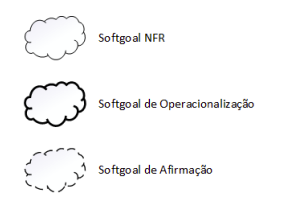
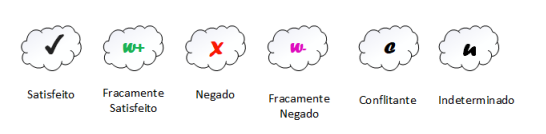
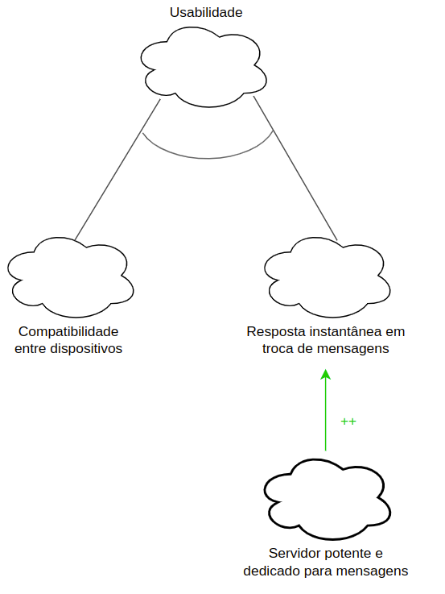
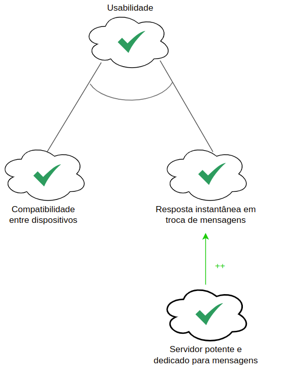
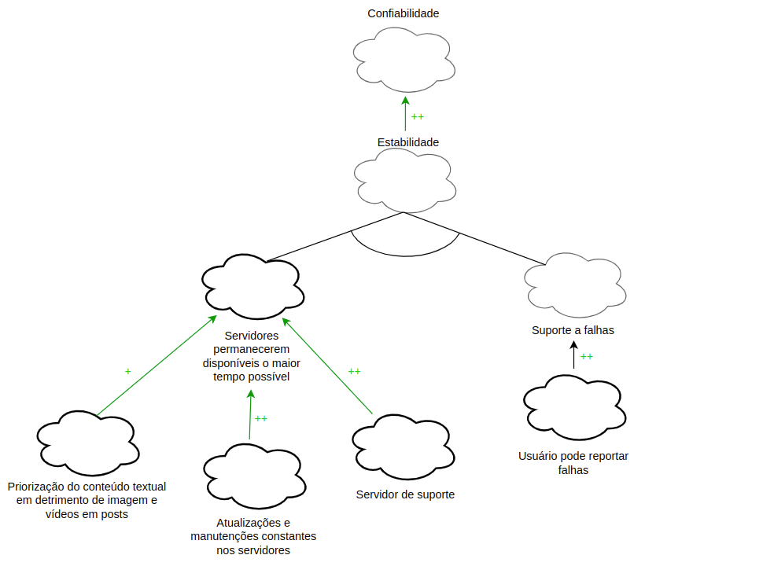
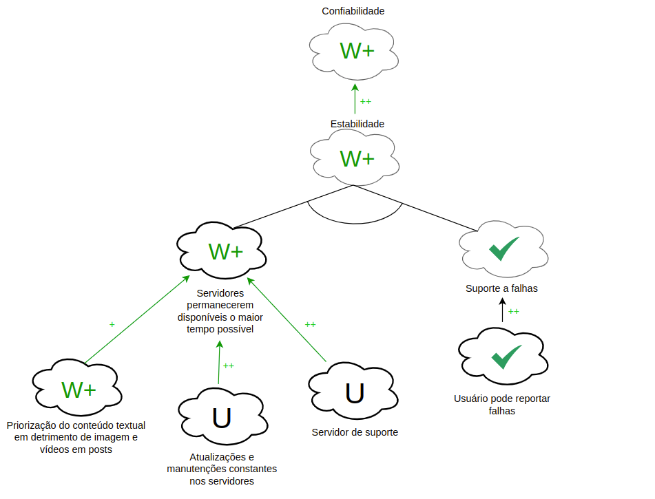
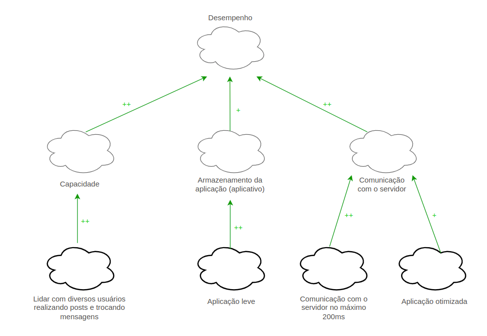
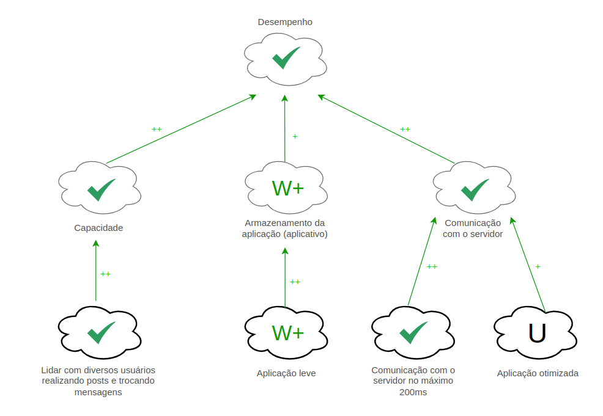
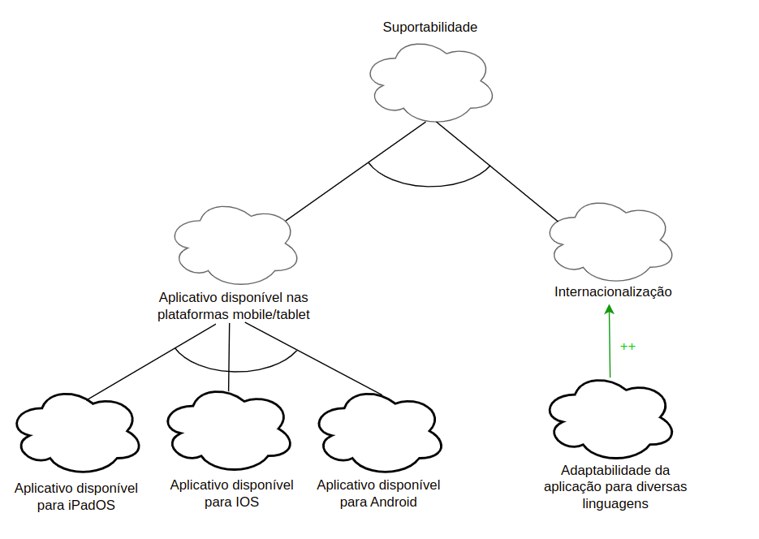
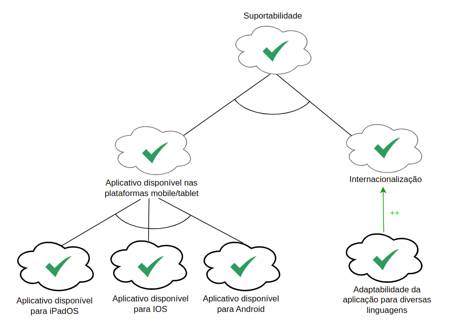

## Histórico de Versões

**Data** | **Versão** | **Descrição** | **Autor(es/as)** | **Revisor** |
:---: | :---: | :---: | :---: | :---: |
03/01/2023 | 0.1 | Elaboração do NFR | Guilherme Barbosa | Letícia Aires e Samuel Castro |

## Introdução

O NFR Framework é uma abordagem para representar e analisar os Requisitos Não-Funcionais de um software. Tem como objetivo ajudar na implementação de soluções personalizadas, levando em consideração as características do domínio e do sistema em questão, a partir da utilização do modelo SIG (Softgoal Independency Graph).

## Softgoals

- Softgoal NFR: São características abstratas que são postas a análises visando saber se a mesma será cumprida ou não, ou seja, será escolhida ou não para ser implementada. No fundo, são requisitos não funcionais categorizados em critérios/atributos de qualidade.
- Softgoal de Operacionalização: Representam as funcionalidades como uma forma concreta de viabilizar ou não as características abstratas.
- Softgoal de Afirmação: Aqui entram as características externas de cada softgoal, ou seja, são consideradas e refletidas na decisão, justificando a priorização do softgoal.

<figure markdown>

<figcaption>Figura 1: Legenda Softgoals</figcaption>
</figure>

## Decomposições

As decomposições podem ser divididas em 4 grupos e servem como um refinamento para obter os softgoals mais especializados. As divisões são:

- Decomposição de Softgoal NFR: Refina ou subdivide um softgoal NFR em outros específicos. Divide problemas grandes em menores e ajuda a lidar com ambiguidades e prioridades.
- Decomposição de Operacionalização: Realiza a subdivisão de um softgoal de operacionalização em outros softgoals de operacionalização mais específicos. Ajuda a definir uma solução geral e depois refiná-las em soluções mais específicas.
- Decomposição de Afirmação: Refina um softgoal de afirmação em outros softgoals de afirmação. Ajuda a apoiar ou negar justificativas específicas que ocorrem no projeto.
- Priorização: Refina um software em outro softgoal com o mesmo tipo e tópicos, mas com uma prioridade associada.

## Contribuições

As contribuições representam como um softgoal descendente contribui para a satisfação de um softgoal ascendente, podendo ser positivas ou negativas, ou até mesmo satisfazendo por completo o ascendente.

Tipos de contribuições utilizadas pelo framework:

- AND: O ascendente é satisfeito se somente se todos os descendentes forem satisfeitos
- OR: O ascendente é satisfeito se um dos descendentes for satisfeito
- MAKE(++): O descendente com contribuição tão positiva a ponto de satisfazer o ascendente
- BREAK(--): O descendente com contribuição tão negativa a ponto de negar o ascendente
- HELP(+): O descendente com contribuição positiva parcial, que sozinho não satisfaz o ascendente
- HURT(-): O descendente com contribuição negativa parcial, que sozinha não chega a negar o ascendente
- UNKNOWN: O ascendente não afeta o pai
- EQUAL: Determina que o softgoal descendente só será satisfeito se o softgoal ascendente for satisfeito e que softgoal descendente será negado se o softgoal ascendente for negado.
- SOME(+/-): O descendente com contribuição (positiva ou negativa), onde a intensidade não se pode determinar

## Metodologia

A elaboração dos diagramas SIG foram construídas a partir dos requisitos não funcionais da Especificação Suplementar. Abordamos os NFRs através de uma decomposição desses requisitos em um nível operacional, garantindo que as necessidades dos clientes sejam atendidas.

### Legenda

Utilizamos os tipos de rótulos utilizados pelos softgoals do framework, representadas na Figura 2, bem como as setas das contribuições na Figura 3. E os softgoals seguindo o padrão representado na Figura 1.

<figure markdown>

<figcaption>
    Figura 2: Tipos de rótulos utilizados pelos softgoals, retirado da dissertação "NFR4ES: Um Catálogo de Requisitos Não-Funcionais para Sistemas Embarcados", de Reinaldo Antônio da Silva.    
</figcaption>
</figure>

<figure markdown>

<figcaption>
    Figura 3: Setas
</figcaption>
</figure>

## Gráfico de Interdependencia de Softgoal (SIG)

### Usabilidade
<figure markdown>

<figcaption>
    Figura 4: NFR usabilidade
</figcaption>
</figure>

### Usabilidade Propagação

<figure markdown>

<figcaption>
    Figura 5: NFR usabilidade Propagação
</figcaption>
</figure>

### Confiabilidade
<figure markdown>

<figcaption>
    Figura 6: NFR confiabilidade
</figcaption>
</figure>

### Confiabilidade Propagação

<figure markdown>

<figcaption>
    Figura 7: NFR Confiabilidade Propagação
</figcaption>
</figure>

### Desempenho
<figure markdown>

<figcaption>
    Figura 8: NFR Desempenho
</figcaption>
</figure>

### Desempenho Propagação

<figure markdown>

<figcaption>
    Figura 9: NFR Desempenho Propagação
</figcaption>
</figure>

### Suportabilidade
<figure markdown>

<figcaption>
    Figura 10: NFR Suportabilidade
</figcaption>
</figure>

### Suportabilidade Propagação

<figure markdown>

<figcaption>
    Figura 11: NFR Suportabilidade Propagação
</figcaption>
</figure>

## Referências
> SILVA, Reinaldo Antônio da. NFR4ES: Um Catálogo de Requisitos Não-Funcionais para Sistemas Embarcados. Universidade Federal de Pernambuco, Recife, 2019. 2.4 - NFR Framework.

> PARADKAR, Mastering Non-Functional Requirements. Universidade Federal de Pernambuco, Recife, 2017.

> SERRANO, Maurício; SERRANO, Milene; Requisitos - Aula 17. Disponível em: https://aprender3.unb.br/pluginfile.php/2307541/mod_resource/content/1/Requisitos%20-%20Aula%20019a.pdf. Acesso em: 03 jan. 2023.