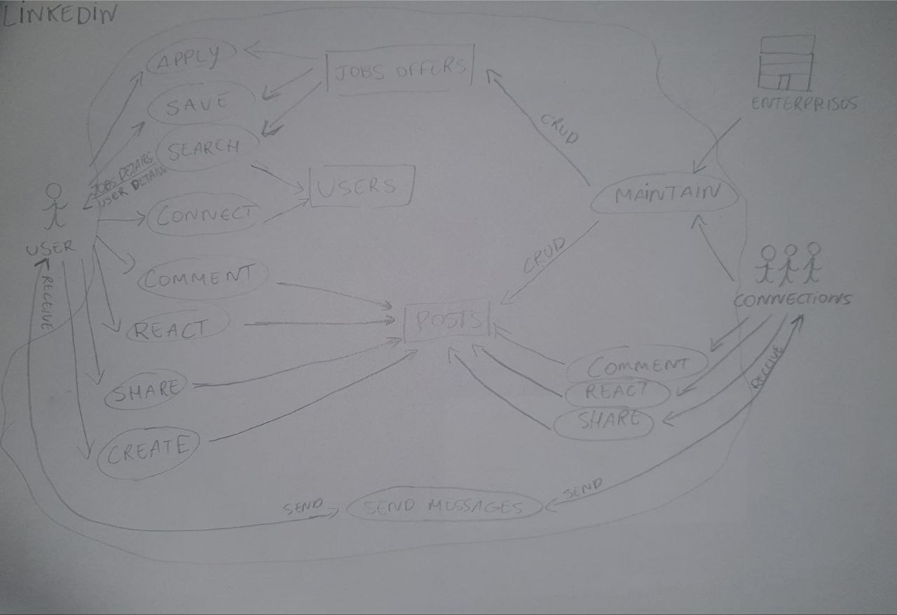
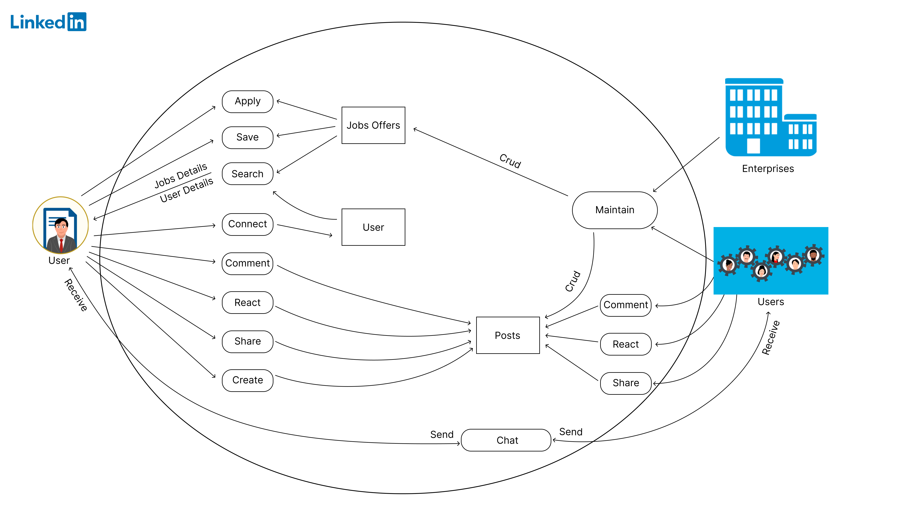
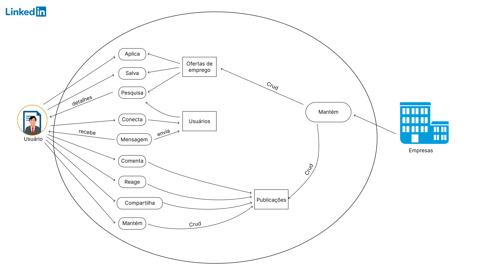
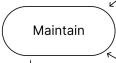
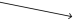
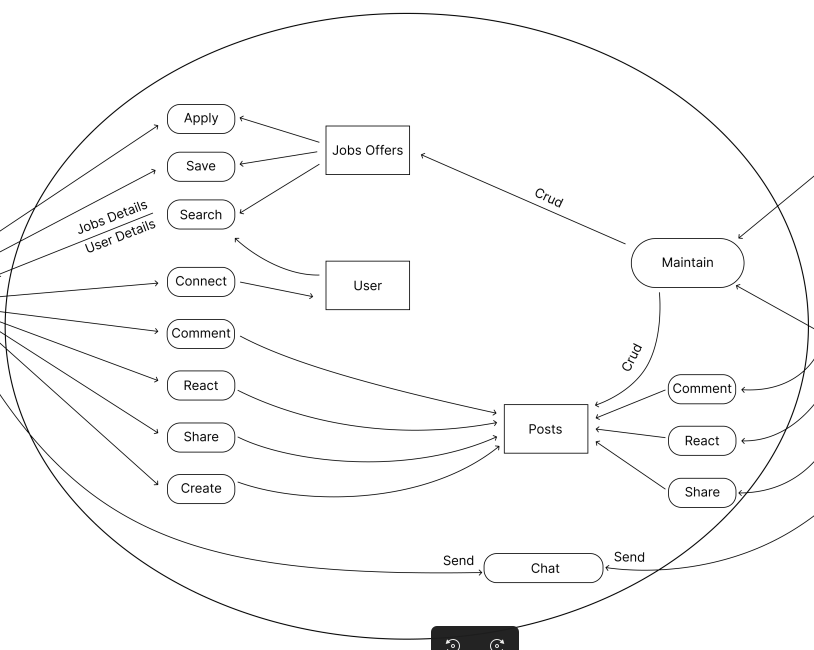

## Histórico de Versões

**Versão** | **Data** | **Descrição** | **Autor(es/as)** | **Revisor** |
:---: | :---: | :---: | :---: | :---: |
 0.1 | 11/11/2022 | Criação do Primeiro Rich Picture | Guilherme Barbosa | Mateus Franco |
 0.2 | 13/11/2022 | Segunda Versão do Rich Picure | Pedro Henrique e Guilherme Barbosa | Mateus Franco |
 0.3 | 14/11/2022 | Adição da legenda do Rich Picture e das referências | Pedro Henrique e Guilherme Barbosa | Mateus Franco |
 0.4 | 23/11/2022 | Terceira Versão do Rich Picture | Guilherme Barbosa | Mateus Franco |

## 1. Introdução

O Rich Picture é uma ferramenta efetiva para analisar problemas e expressar ideias, com uma característica de ser fácil de entender. Sua função é descrever, através de uma forma ilustrativa, o produto de software e as principais ações e interações externas e internas. O Rich Picture concede a possibilidade de auxiliar da identificação de processos de negócio, de atores envolvidos, dos relacionamentos entre os processos e atores e possíveis problemas e conflitos.

## 2. Metodologia

Há um guia disponível no `Introducing Rich Pictures - Rich Picture Drawline Guidelines (Página 4)`, que descreve alguns componentes que devem ser utilizados na construção do Rich Picture, e é o que iremos abordar no nosso escopo:

* Identificar os atores;
* Identificar as operações de cada ator ou outras operações;
* Identificar os dados que estarão presentes na aplicação, caracterizados por serem tabelas dentro do banco de dados;
* Utilizar as ligações através de setas;
* Desenhar os limites do sistema, ou seja, até onde o sistema é responsável por realizar as operações.

## 3. Rich Picture - Primeira versão

<h6 align = "center"> Figura 1: Rich Picture - Versão 1.0
  Autor: Guilherme Barbosa
  Fonte: Autores </h6>

## 4. Rich Picture - Segunda versão

<h6 align = "center"> Figura 2: Rich Picture - Versão 2.0
  Autores: Pedro Henrique e Guilherme Barbosa
  Fonte: Autores </h6>

## 5. Rich Picture - Terceira versão

<h6 align = "center"> Figura 3: Rich Picture - Versão 2.0
  Autores: Pedro Henrique e Guilherme Barbosa
  Fonte: Autores </h6>

| Componentes | Comentários |
| ----------- | ----------- |
| <h3><b>Atores</h3></b> { width=100 } { width=100 }| São os usuários do sistema. Normalmente os atores podem realizar qualquer quantidade de operações. |
| <h3><b>Operações</h3></b> { width=100 } | Uma operação especifica o que o sistema faz. Um ator ou uma outra operação podem executar uma operação. Estão representadas como um círculo ou um oval com uma descrição. |
| <h3><b>Armazenamento de dados</b></h3> { width=100 } | Os armazenamentos de dados representam as tabelas presentes no banco de dados. Estão representadas dentro de um retângulo e com o tipo de dados que contêm.
| <h3><b>Setas</h3></b> { width=100 } | Mostram a direção do fluxo de dados entre os atores, armazenamento de dados e as operações. |
| <h3><b>Limites do Sistema</h3></b> { width=100 } | Identifica aquelas operações que fazem parte do sistema, ou seja, tudo que está dentro do limite designado, o sistema é o responsável por realizar.

<h6 align = "center"> Tabela 2: Legenda do Rich Picture
  Fonte: Autores </h6>

## 5. Referências

“Introducing Rich Pictures” do CTEC2402 - Software Development
Project

Apresentação da aula de Requisitos - Pré-rastreabilidade - Rich Picture Aula 04.pdfArquivo. Link: <https://aprender3.unb.br/pluginfile.php/2307459/mod_resource/content/4/Requisitos%20-%20Aula%2004%20-%20Parte%202%20RichPicture.pdf>
