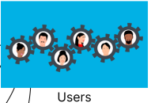

## Versionamento

| Versão | Data       |   Modificação   |             Autor              |
| ------ | ---------- | :-------------: | :----------------------------: |
| 1.0    | 11/11/2022 | Criação do Primeiro Rich Picture | Guilherme Barbosa |
| 1.1.0    | 13/11/2022 | Segunda Versão do Rich Picure | Pedro Henrique e Guilherme Barbosa|
| 1.1.1 | 14/11/2022 | Adição da legenda do Rich Picture | Guilherme Barbosa

*Tabela 1: Versionamento*

## Introdução
O Rich Picture é uma ferramenta efetiva para analisar problemas e expressar ideias, com uma característica de ser fácil de entender. Sua função é descrever, através de uma forma ilustrativa, o produto de software e as principais ações e interações externas e internas. O Rich Picture concede a possibilidade de auxiliar da identificação de processos de negócio, de atores envolvidos, dos relacionamentos entre os processos e atores e possíveis problemas e conflitos.

## Metodologia
Há um guia disponível no `Introducing Rich Pictures - Rich Picture Drawline Guidelines (Página 4)`, que descreve alguns componentes que devem ser utilizados na construção do Rich Picture, e é o que iremos abordar no nosso escopo:

* Identificar os atores;
* Identificar as operações de cada ator ou outras operações;
* Identificar os dados que estarão presentes na aplicação, caracterizados por serem tabelas dentro do banco de dados;
* Utilizar as ligações através de setas;
* Desenhar os limites do sistema, ou seja, até onde o sistema é responsável por realizar as operações.

## Rich Picture 1

*Figura 1: Rich Picture. Autor: Guilherme Barbosa, Versão 1.0*

## Rich Picture 2

*Figura 2: Rich Picture 2. Autores: Pedro Henrique e Guilherme Barbosa, Versão 1.1*

| Componentes | Comentários |
| ----------- | ----------- |
| <h3><b>Atores</h3></b> { width=100 } { width=100 } { width=100 }| São os usuários do sistema. Normalmente os atores podem realizar qualquer quantidade de operações. |
| <h3><b>Operações</h3></b> { width=100 } | Uma operação especifica o que o sistema faz. Um ator ou uma outra operação podem executar uma operação. Estão representadas como um círculo ou um oval com uma descrição. |
| <h3><b>Armazenamento de dados</b></h3> { width=100 } | Os armazenamentos de dados representam as tabelas presentes no banco de dados. Estão representadas dentro de um retângulo e com o tipo de dados que contêm.
| <h3><b>Setas</h3></b> { width=100 } | Mostram a direção do fluxo de dados entre os atores, armazenamento de dados e as operações. |
| <h3><b>Limites do Sistema</h3></b> { width=100 } | Identifica aquelas operações que fazem parte do sistema, ou seja, tudo que está dentro do limite designado, o sistema é o responsável por realizar.

*Tabela 2: Legenda do Rich Picture*